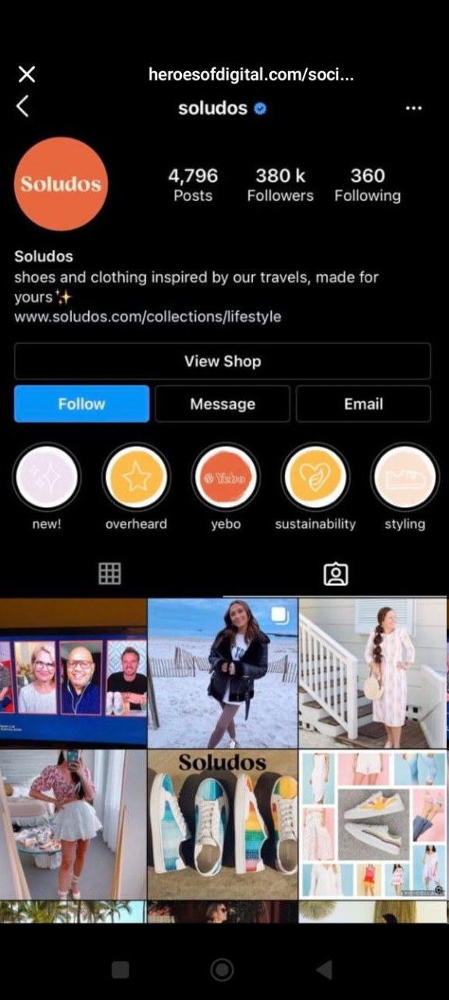
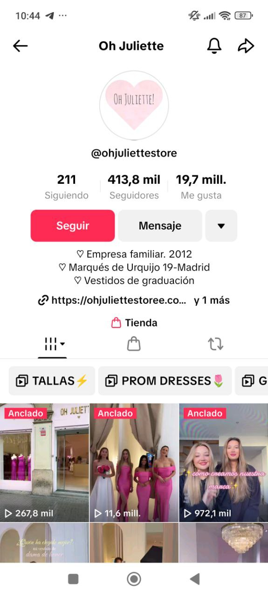

# Social Commerce

#### 🛍️ ¿Qué es exactamente _Social Commerce_?

**Social Commerce** es cuando \*\*todo el proceso de compra —desde descubrir el producto hasta pagarlo— ocurre **dentro de la plataforma social**, sin salir de ahí.

👉 Ejemplos:

* Comprar directamente desde un post en **Instagram Shop**, **Facebook Shop** o **TikTok Shop**.
* Hacer checkout en la misma app con tarjetas o PayPal.
* Participar en un **live shopping** donde compras desde el mismo directo.

#### 💡 **“Tráfico Referido” o “Social Selling con redirección”**

(también se acepta como parte del _E-commerce tradicional_)

🔹 ¿Cómo funciona?\
Usas las redes sociales como **canal de promoción y atracción**, pero el **proceso de compra ocurre fuera**, en tu web o en una plataforma tipo Etsy, Shopify, Amazon, etc.

📌 Nombre técnico más común:

* **Social Media Marketing (SMM)** orientado a conversión.
* **Referral Traffic via Social Media**
* **Social Selling tradicional**

👉 _En este modelo, las redes sociales son como el cartel luminoso que llama la atención, pero la tienda real está en otro sitio._

#### 🥊 Entonces, ¿cuál es la diferencia clave?

|                       | Social Commerce             | Social Selling / Tráfico Referido |
| --------------------- | --------------------------- | --------------------------------- |
| ¿Dónde se paga?       | Dentro de la red social     | En sitio web externo              |
| ¿Plataformas comunes? | TikTok Shop, Instagram Shop | Shopify, Etsy, Amazon, etc.       |
| ¿Control del proceso? | Lo tiene la red social      | Lo tienes tú desde tu web         |

**"E-commerce"** es una **subcategoría de "commerce"**, al igual que **"social commerce"** lo es también.

📊 Para que lo veas claro:

```
Commerce (comercio en general)
├── Comercio físico (tiendas, mercados)
├── E-commerce (ventas por internet)
│   ├── Marketplace (Amazon, Etsy)
│   ├── Tienda propia (Shopify, WooCommerce)
│   └── Social commerce (Instagram, TikTok Shop)

```

#### 🌐 E-commerce = Todo lo que se vende por internet

Incluye:

* Tiendas online propias (Shopify, WooCommerce)
* Marketplaces (Amazon, Etsy, eBay)
* **Redes sociales con función de venta (social commerce)**

#### 📲 Social Commerce = Una evolución del E-commerce

Pero tiene algo muy especial:

✅ **No solo vende por internet**, sino que:

* **Aprovecha el poder de las redes sociales** (engagement, comunidad, contenido, influencers)
* Integra el proceso completo **dentro de la red**: desde el descubrimiento hasta el pago.

👉 Ejemplo: Ves una blusa en un Reel, haces clic, eliges talla, pagas en Instagram, ¡y listo! Nunca saliste de la app.

🧬 Relación jerárquica (modo árbol):

E-commerce (ventas digitales)\
├── Tienda online tradicional (web propia)\
├── Marketplace (Amazon, Etsy)\
└── Social Commerce (TikTok Shop, Instagram Shop)

**Instagram es una herramienta muy útil para impulsar las ventas de tu negocio**

* Puedes crear tu tienda en Instagram
* Mostrar tu catálogo con varios productos
* Llevar tráfico a tu sitio web
* Es una vitrina de tu negocio, con pocos clics el usuario puede hacer su compra

**Conecta con tu comunidad para crecer tu e-commerce**

* Comunica a tu comunidad que tienes una tienda
* Crea anuncios en los diferentes formatos
* Crea contenidos con aliados Aprovecha los formatos que te ofrece Instagram para crear momentos de compra
* Solicita feedback sobre tus productos
* Produce contenido interactivo con tu comunidad, stickers, filtros, challenges, etc.

Utiliza el tag de producto Coloca tu tienda en el feed Video de compra/animados Reels virales y con catálogo Stories usando links o stickers de interacción

#### **¿Facebook tiene su propio marketplace?**

**¡Sí, se llama&#x20;**_**Facebook Marketplace**_**!**\
Y no es lo mismo que _Facebook Shops_, aunque los dos se usan para vender.

***

#### 📦 **Facebook Marketplace**

🔹 Es como una **plaza de compra-venta dentro de Facebook**, donde cualquier persona puede publicar lo que vende: desde ropa usada, muebles, hasta un carro.

✅ Características:

* Ideal para ventas **de persona a persona (C2C)**.
* Muy útil para productos **de segunda mano o locales**.
* No necesitas tienda ni catálogo.
* Funciona mucho por mensajes directos y regateo.
* No hay pasarela de pago integrada (la gente acuerda por WhatsApp o Messenger).

💡 **Ejemplo:** Tú vendes una bici que ya no usas. Subes la foto, pones precio, y alguien de tu zona te escribe.

***

#### 🏪 **Facebook Shops**

🔹 Es una **solución de e-commerce integrada** para marcas y empresas, que te permite crear un catálogo de productos directamente en Facebook e Instagram.

✅ Características:

* Ideal para negocios con productos organizados.
* Puedes integrar tu catálogo desde Shopify o WooCommerce.
* En algunos países ya permite **comprar directamente desde Facebook o Instagram** (social commerce).
* Se sincroniza con Instagram Shopping.

💡 **Ejemplo:** Tu tienda de ropa tiene su catálogo conectado y las clientas pueden ver los productos en la página y comprarlos.

***

#### ⚖️ Diferencias clave:

|                | Facebook Marketplace          | Facebook Shops                 |
| -------------- | ----------------------------- | ------------------------------ |
| ¿Quién lo usa? | Personas, vendedores casuales | Marcas, tiendas, emprendedores |
| Tipo de venta  | Directa entre usuarios        | Profesional, catálogo online   |
| Tiene checkout | ❌ No                          | ✅ En algunos países            |
| Ideal para     | Usado, local, rápido          | Negocios, venta organizada     |

### 🎯 PRIMERO: ¿Instagram Shop e Instagram Shopping son lo mismo?

**Técnicamente, sí.**\
Meta (Facebook/Instagram) **usa ambos términos como parte del mismo ecosistema**, pero en la práctica hay un **matiz sutil**:

| Término                | Uso más común                                  | Qué abarca en realidad                                               |
| ---------------------- | ---------------------------------------------- | -------------------------------------------------------------------- |
| **Instagram Shop**     | La **tienda visible** en tu perfil de IG       | Es la "fachada" de tu tienda, donde se ve el catálogo                |
| **Instagram Shopping** | El **conjunto de funciones para vender** en IG | Incluye el catálogo, la tienda, las etiquetas, y el checkout directo |

🧠 **Piensa así:**

* _Instagram Shop_ = la tienda como espacio visual en tu perfil.
* _Instagram Shopping_ = todo el sistema para vender (Shop + etiquetas + checkout + conexión con Facebook).

Meta no ayuda mucho con los nombres, pero **oficialmente en sus docs a veces los usan indistintamente**, lo que crea la confusión.

***

### 🛒 Entonces… ¿es Social Commerce?

**¡Sí, totalmente!**

Cuando tú vendes en **Instagram Shop o TikTok Shop** y el usuario **completa todo el embudo dentro de la red social** —desde que descubre el producto hasta que paga—, eso es **100% Social Commerce**.

🔄 **Es decir:**

* Social commerce = tipo de venta dentro de la plataforma.
* Instagram Shopping / TikTok Shop / Facebook Shop = herramientas específicas para lograr esa venta.

***

### 💭 ¿Y lo de Google Shopping?

Eso es otra historia distinta, aunque suena parecido.

| Plataforma          | Tipo de comercio                | ¿Dónde ocurre la venta?                 | Canal                       |
| ------------------- | ------------------------------- | --------------------------------------- | --------------------------- |
| **Instagram Shop**  | Social Commerce                 | Dentro de Instagram (en algunos países) | Instagram                   |
| **TikTok Shop**     | Social Commerce                 | Dentro de TikTok                        | TikTok                      |
| **Google Shopping** | E-commerce clásico con anuncios | Redirige a la web del vendedor          | Google Ads + tienda externa |

### ✅ CONCLUSIÓN RESUMIDA&#x20;

* **Social Commerce**: se refiere al modelo de venta **dentro** de la red social (TikTok Shop, IG Shop, etc.).
* **Instagram Shop** y **Instagram Shopping** son **prácticamente lo mismo**, pero:
  * _Shop_ = la tienda que ves.
  * _Shopping_ = todo el sistema de venta.
* **Google Shopping no es social commerce**, es un **canal de e-commerce tradicional** (redirige a web).
* Y sí, **todo lo que se vende dentro de TikTok Shop, Facebook Shop, Instagram Shop** es parte del universo de **social commerce**.

### 🛍️ Plataformas que permiten **comprar sin salir de la app** (Social Commerce real):

#### ✅ **1. TikTok Shop**

* 🚀 Súper fuerte en EE.UU. y Asia.
* Vendes directamente desde el video, el live o el perfil.
* Tiene pasarela de pago y logística integrada (en algunos países).
* Ideal para vender con influencers y creadores.

***

#### ✅ **2. Instagram Shop** (con checkout activado)

* Solo disponible en algunos países como EE.UU.
* El usuario ve el producto, lo toca, lo paga dentro de la app.
* Funciona conectada al catálogo desde Facebook Commerce Manager.

***

#### ✅ **3. Facebook Shop** (con checkout activado)

* Igual que Instagram, pero desde Facebook.
* Puedes vender desde la tienda o desde publicaciones.
* Ideal para públicos mayores de 30 años.

***

#### ✅ **4. Pinterest**

* Tiene **Pinterest Shopping** y **Product Pins**.
* En países como EE.UU., **ya permite comprar dentro de la app** sin salir.
* Se está posicionando como social commerce visual y aspiracional.
* Ideal para moda, decoración, DIY, etc.

***

#### ✅ **5. YouTube Shopping**

* **Integrado con Shopify y otros sistemas de e-commerce**.
* Permite mostrar productos debajo de los videos, en vivo y shorts.
* En algunos países ya tienen **checkout directo** sin salir de YouTube.

***

#### ✅ **6. WhatsApp Business (con catálogos y pagos integrados)**

* En algunos países (India, Brasil, México), ya puedes **pagar dentro del chat**.
* Se usa mucho para social selling directo: mostrar producto y cerrar la venta ahí mismo.
* No es una tienda como tal, pero el ciclo completo ocurre **dentro de la app**.

***

### 🛍️ Plataformas que permiten **comprar sin salir de la app** (Social Commerce real):

#### ✅ **1. TikTok Shop**

* 🚀 Súper fuerte en EE.UU. y Asia.
* Vendes directamente desde el video, el live o el perfil.
* Tiene pasarela de pago y logística integrada (en algunos países).
* Ideal para vender con influencers y creadores.

***

#### ✅ **2. Instagram Shop** (con checkout activado)

* Solo disponible en algunos países como EE.UU.
* El usuario ve el producto, lo toca, lo paga dentro de la app.
* Funciona conectada al catálogo desde Facebook Commerce Manager.

***

#### ✅ **3. Facebook Shop** (con checkout activado)

* Igual que Instagram, pero desde Facebook.
* Puedes vender desde la tienda o desde publicaciones.
* Ideal para públicos mayores de 30 años.

***

#### ✅ **4. Pinterest**

* Tiene **Pinterest Shopping** y **Product Pins**.
* En países como EE.UU., **ya permite comprar dentro de la app** sin salir.
* Se está posicionando como social commerce visual y aspiracional.
* Ideal para moda, decoración, DIY, etc.

***

#### ✅ **5. YouTube Shopping**

* **Integrado con Shopify y otros sistemas de e-commerce**.
* Permite mostrar productos debajo de los videos, en vivo y shorts.
* En algunos países ya tienen **checkout directo** sin salir de YouTube.

***

#### ✅ **6. WhatsApp Business (con catálogos y pagos integrados)**

* En algunos países (India, Brasil, México), ya puedes **pagar dentro del chat**.
* Se usa mucho para social selling directo: mostrar producto y cerrar la venta ahí mismo.
* No es una tienda como tal, pero el ciclo completo ocurre **dentro de la app**.

### 🧐 ¿Quiénes _no_ tienen aún venta directa dentro de la app?

| Plataforma      | ¿Vende dentro de la app? | Notas                                                                  |
| --------------- | ------------------------ | ---------------------------------------------------------------------- |
| **X (Twitter)** | ❌ No                     | Solo redirige a enlaces externos, aunque están probando integraciones. |
| **LinkedIn**    | ❌ No                     | Muy corporativo. Usado más para B2B y leads.                           |
| **Snapchat**    | 🚧 En pruebas            | Está desarrollando su sistema de social commerce con AR.               |

### 🧠 Conclusión resumida:

| Plataforma        | ¿Se puede comprar sin salir de la app? | Nivel de desarrollo   |
| ----------------- | -------------------------------------- | --------------------- |
| TikTok Shop       | ✅ Sí                                   | Muy avanzado          |
| Instagram Shop    | ✅ En algunos países (EE.UU.)           | Avanzado              |
| Facebook Shop     | ✅ En algunos países                    | Avanzado              |
| Pinterest         | ✅ En países selectos                   | En crecimiento        |
| YouTube Shopping  | ✅ En algunos países                    | Integrado con Shopify |
| WhatsApp Business | ✅ En países como Brasil/India          | En expansión          |

**Social commerce con pago directo en la app en España (2025), incorporando tanto el análisis detallado como el contexto de tendencias y plataformas emergentes:**

| Plataforma      | ¿Pago directo en app en España? | ¿Redirige fuera de la app? | Estado actual y notas clave (2025)                                                                                                                       | Tendencias y cambios relevantes |
| --------------- | ------------------------------- | -------------------------- | -------------------------------------------------------------------------------------------------------------------------------------------------------- | ------------------------------- |
| **TikTok Shop** | ✅ Sí                            | No                         | Lanzada en España en 2025. Permite comprar y pagar desde vídeos, lives y escaparates sin salir de la app. Nichos fuertes: moda, tecnología, alimentación |                                 |

| .                        | Consolidación y expansión en Europa y Latam. |       |                                                                                                                          |                                                |
| ------------------------ | -------------------------------------------- | ----- | ------------------------------------------------------------------------------------------------------------------------ | ---------------------------------------------- |
| **Instagram Shopping**   | ❌ No                                         | Sí    | En España y Europa, el pago se realiza en la web del vendedor. Checkout nativo solo en EE.UU.                            | Meta elimina checkout fuera de EE.UU. en 2025. |
| **Facebook Shops**       | ❌ No                                         | Sí    | Igual que Instagram: redirige a la web externa en España y Europa. Checkout in-app solo EE.UU.                           | Reducción de funciones fuera de EE.UU.         |
| **Pinterest Shopping**   | ❌ No                                         | Sí    | Compra directa solo en EE.UU. En España, los Product Pins llevan a web externa.                                          | En expansión, pero limitada en Europa.         |
| **YouTube Shopping**     | ❌ No (en España)                             | Sí    | Checkout directo solo en EE.UU., India y algunos países. En España, muestra productos pero la compra es fuera de la app. | Previsto crecimiento de checkout in-app.       |
| **WhatsApp Business**    | ❌ No                                         | Sí/No | Pagos integrados solo en India, Brasil, México. En España, catálogo y gestión de pedidos, pero pago fuera de la app.     | En pruebas pagos in-app en nuevos mercados.    |
| **Grip, Snapchat, etc.** | ❌ No (en España)                             | Sí/No | Innovación en social commerce (live, AR), pero sin pago directo en app en España.                                        | Potencial futuro, aún baja penetración local.  |

### Resumen clave para España (2025):

* **Solo TikTok Shop** permite social commerce real (compra y pago 100% dentro de la app) en España actualmente
* **Instagram Shopping**, **Facebook Shops**, **Pinterest Shopping**, **YouTube Shopping** y **WhatsApp Business** en España redirigen al usuario fuera de la app para completar el pago.
* Plataformas emergentes (Grip, Snapchat) están innovando, pero aún no ofrecen pago directo in-app en España.
* La tendencia global es la consolidación de TikTok Shop y la expansión progresiva de checkout in-app en otras plataformas, especialmente en mercados anglosajones y asiáticos.

Esta tabla resume de manera integral el estado actual y las tendencias del social commerce real en España y su proyección para los próximos años.


### Cómo funciona el catálogo de productos en Facebook e Instagram <a href="#cmo-funciona-el-catlogo-de-productos-en-facebook-e" id="cmo-funciona-el-catlogo-de-productos-en-facebook-e"></a>

### 1. Crear un catálogo de productos en Facebook

* **Accede a Facebook Business Manager**: Es necesario tener una cuenta en Facebook Business Manager para gestionar catálogos y anuncios.
* **Crea el catálogo**:
  * Ve a “Más herramientas” y selecciona “Comercio”.
  * En la sección “Catálogos”, haz clic en “Agregar catálogo”.
  * Elige la categoría (por ejemplo, “Productos online”) y completa los datos solicitados.
  * Puedes subir productos manualmente, mediante un archivo o conectando tu tienda online.
* **Conecta un píxel de Meta** (opcional): Permite hacer seguimiento de la interacción con los productos.
* **Gestiona y organiza tus productos**: Puedes clasificar, editar y optimizar la información de cada producto desde el panel de administración

### 2. Etiquetar productos en publicaciones y anuncios de Facebook

* Cuando creas una publicación o anuncio, puedes **etiquetar productos** directamente desde tu catálogo.
* Al etiquetar, el usuario que haga clic será dirigido a la página de producto en tu e-commerce o tienda online.
* Esto facilita la promoción de productos específicos y mejora la experiencia de compra desde Facebook

### 3. Exportar y sincronizar el catálogo con Instagram

* **Vincula tu cuenta de Instagram con Facebook**: Es imprescindible que tu cuenta de Instagram sea de empresa y esté conectada a tu página de Facebook.
* **Activa Instagram Shopping**:
  * Desde la configuración de Instagram, accede a “Empresa” y luego a “Compras en Instagram”.
  * Selecciona el catálogo de productos que ya creaste en Facebook.
  * Envía tu cuenta a revisión para que Instagram apruebe la función de compras
* **Sincronización automática**: Una vez aprobado, el catálogo de Facebook se sincroniza automáticamente con Instagram. No es necesario subir los productos dos veces

### 4. Etiquetar productos en Instagram

* Al crear una publicación o historia, selecciona la opción “Etiquetar productos”.
* Elige los productos de tu catálogo sincronizado.
* Puedes etiquetar hasta 5 productos por imagen o video, y hasta 20 en publicaciones tipo carrusel.
* Los usuarios verán la etiqueta de compra y, al hacer clic, serán dirigidos a la página de producto en tu tienda online

### Resumen visual

| Plataforma | ¿Catálogo propio? | ¿Etiquetar productos? | ¿Pago directo en app (España)? | ¿Redirige a web externa? |
| ---------- | ----------------- | --------------------- | ------------------------------ | ------------------------ |
| Facebook   | Sí                | Sí                    | No                             | Sí                       |
| Instagram  | Sí\*              | Sí                    | No                             | Sí                       |

\*El catálogo se crea y gestiona desde Facebook y se exporta/sincroniza a Instagram automáticamente.

**En conclusión:**\
Puedes crear y gestionar tu catálogo de productos desde Facebook, etiquetar productos en publicaciones y anuncios, y sincronizar ese catálogo con Instagram para etiquetar productos en ambas plataformas. En España, el proceso de compra se completa en la web del e-commerce, no dentro de la app

**Link para crear un catálogo en meta:**



<figure><figcaption></figcaption></figure>

<figure><figcaption></figcaption></figure>


Mira, aquí tienes una captura real (aunque del 2021) del perfil de @soludos mostrando claramente el botón “Ver tienda” y el acceso directo al catálogo dentro de Instagram .

***

🛒 Así es como se ve una tienda real en Instagram (como la de Soludos)

1. Icono de bolsita (Shop) o pestaña “Tienda” visible en el perfil.
2. Cuando tocas, entras a un catálogo dentro de Instagram, con:

Fotografías del producto

Precios real‑time

Etiquetas que te llevan a la ficha de detalle

3. Todo esto sin salir de la app — es social commerce puro .

***

🎯 ¿Por qué no lo ves en España?

Como te comenté:

Instagram limita esta función a ciertos países (EE.UU., Canadá, UK, Australia…).

En España, aunque algunas funciones están activas, el Shop completo con catálogo y checkout a muchas cuentas aún no se despliega.

En efecto, **en España sí puedes crear y gestionar un catálogo de productos para Instagram Shopping y Facebook Shops**, pero con algunas particularidades importantes que explican por qué a veces no ves un catálogo o tienda visible para el usuario final:

### Catálogo&#x20;

* **Crear catálogo y etiquetar productos sí está permitido** en España, siempre que cumplas los requisitos oficiales:
  * Perfil de empresa en Instagram.
  * Catálogo creado y gestionado en Facebook Business Manager.
  * Cumplimiento de políticas de comercio y venta de productos físicos.
  * Cuenta vinculada correctamente a Facebook.
  * Aprobación por parte de Instagram tras revisión.
* **Sin embargo, la función de “checkout nativo” (pago dentro de la app) solo está disponible en EE.UU.**, por lo que en España la compra final se realiza fuera de Instagram o Facebook, en la web del vendedor.
* **La pestaña “Tienda” o “Ver tienda” en el perfil no siempre aparece visible**, incluso si tienes catálogo y etiquetas de productos activas. Esto depende de la configuración, aprobación y políticas internas de Instagram, además de la estrategia de la marca.
* Muchas marcas en España usan Instagram para **etiquetar productos en publicaciones y stories**, pero no activan o no tienen visible la pestaña “Tienda”. Prefieren dirigir al usuario a su web mediante enlaces en la bio o en las etiquetas.

###

* Busca publicaciones con el **icono de bolsa de compras** en la esquina. Al tocar la imagen, verás etiquetas con productos y precios.
* En stories, busca stickers de producto que llevan a la ficha del producto.
* Si la tienda está activada, en el perfil aparecerá la pestaña **“Tienda”** o botón **“Ver tienda”**, que muestra un escaparate visual con todos los productos.

###

| Aspecto                    | Estado en España (2025)                                               |
| -------------------------- | --------------------------------------------------------------------- |
| Crear y gestionar catálogo | Sí, mediante Facebook Business Manager y perfil empresa en Instagram  |
| Etiquetar productos        | Sí, en publicaciones y stories                                        |
| Pestaña “Tienda” visible   | No siempre; depende de aprobación y configuración                     |
| Checkout dentro de la app  | No, solo disponible en EE.UU.; en España se redirige a la web externa |
| Compra final               | Se completa fuera de Instagram/Facebook                               |

