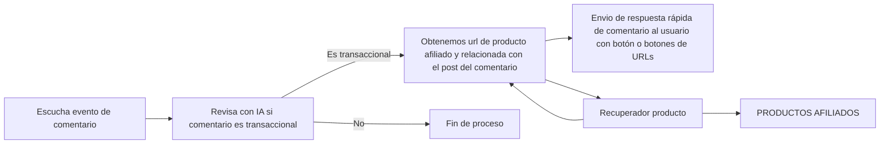
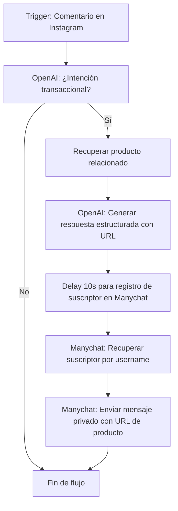
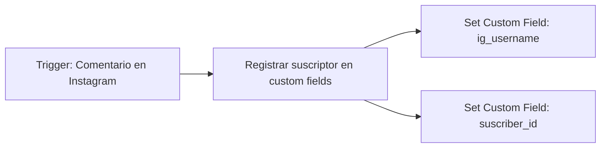

# Documentación

### 1. Esquema de Flujo <a href="#id-1-esquema-de-flujo" id="id-1-esquema-de-flujo"></a>

El flujo preliminar del producto/servicio es el siguiente:



1. **Escucha evento de comentario** en Instagram.
2. **Analiza con IA** si el comentario tiene intención transaccional (compra).
3. **Filtra comentarios**: Si no es transaccional, termina el proceso.
4. **Obtiene producto afiliado** relacionado con el post/comentario.
5. **Recupera URL afiliada** del producto.
6. **Responde automáticamente** al usuario con un comentario que incluye el enlace o botón de compra.
7. **Tracking de ventas y comisiones**: Por cada venta, el influencer y la plataforma reciben comisión.

***

### 2. Herramientas <a href="#id-2-herramientas" id="id-2-herramientas"></a>

Hemos tenido que adaptar el flujo a las herramientas disponibles y sus limitaciones. A continuación, se detallan las herramientas y costes estimados:

* **Manychat**: Dificultad para implementar el recuperador de productos y respuestas estructuradas con IA.
* **Make**: Limitaciones en el envío de mensajes privados, pero permite integrar múltiples módulos y procesar datos estructurados.
* Se utilizará **Make** para gestionar el flujo de trabajo, incluyendo la escucha de comentarios, análisis de intención y recuperación de productos y **Manychat** para el envío de mensajes.
* hay que configurar 1 flujo con responsabiliades diferentes en cada herramienta.

**NOTA**: En Make se Integra un módulo de Manychat para enviar mensajes privados, pero no se tiene que agregar un delay de al menos 10 segundos para que el flujo en paralelo de Manychat pueda registrar de ser necesario el suscriber, que se recuperará desde Make por el API de Manychat.

#### **Make:** <a href="#make" id="make"></a>

* Escucha activa de comentarios:
  * Módulo: Instagram for Business - Trigger de comentarios.
* Análisis de intención:
  * Módulo: OpenAI - Transformar textos a datos estructurados.
    * Formato de respuesta:
    * ```
      {
        "comment_id": <id del comentario>,
        "post_id": <id del post>,
        "comment_text": <texto del comentario>,
        "is_comment_transactional": "true" | "false"
      }
      ```
*   Recuperacion de productos:

    * Módulo: JSON de productos (por simplicidad) pero se debería integrar con una API de productos afiliados.
    * Se recuperan productos a partir de data del post (texto, imagen, hashtags, video, etc...).
    * Modulo: OpenAI - Generar respuesta estructurada con URL de producto.
    * Formato de respuesta:
    * ```
      {
        "comment_id": <id del comentario>,
        "post_id": <id del post>,
        "product_url": <url del producto afiliado>,
       }
      ```

    ```
    ```
* Demora de flujo:
  * Se agrega un delay de 10 segundos para permitir que Manychat registre el suscriptor antes de enviar el mensaje privado.
* Se recupera el suscriptor desde Manychat:
  * Módulo: Manychat - Recuperar suscriptor por username de Instagram y id de customField de manychat.
*   Envío de mensaje privado:

    * Módulo: Manychat - Enviar mensaje privado con URL de producto.
    * Formato de mensaje Body:

    ```
        {
            "subscriber_id": <id del suscriptor>,
            "data": {
                "version": "v2",
                "content": {
                    "type": "instagram",
                    "messages": [
                        {
                            "type": "text",
                            "text": "<texto del mensaje de respuesta al usuario>",
                            "buttons": [
                                {
                                    "type": "url",
                                    "caption": "<caption del botón>",
                                    "url": "<url del botón>"
                                }
                            ]
                        }
                    ]
                }
            }
        }
    ```

**Flujo de Make:**



\
**Descripción de pasos:**

1. **Trigger Instagram:** Se detecta un nuevo comentario en un post.
2. **OpenAI:** Se analiza el texto del comentario para determinar si tiene intención transaccional.
3. **Recuperación de producto:** Si es transaccional, se busca el producto afiliado más relevante según el post/comentario.
4. **OpenAI:** Se genera la respuesta estructurada con la URL del producto.
5. **Delay:** Se espera 10 segundos para asegurar el registro del suscriptor en Manychat.
6. **Manychat:** Se recupera el suscriptor usando el username de Instagram y customField.
7. **Manychat:** Se envía el mensaje privado al usuario con la URL del producto afiliado.
8. **Fin de flujo.**

#### **Manychat:** <a href="#manychat" id="manychat"></a>

* Escucha de comentarios a cualquier post de Instagram.:
  * Módulo: Trigger Post or Reel Comment.
  * Configuracion: Escucha todos los comentarios en todos los posts de Instagram.
* Registro de suscriber en custom fields:
  * Módulo: Actions - Set Custom Field.
  * Campos personalizados:
    * `ig_username`: Username de Instagram del usuario.
    * `suscriber_id`: ID del suscriptor en Manychat.

**Flujo de Manychat:**



**Descripción de pasos:**

1. **Trigger Post or Reel Comment:** Manychat detecta cualquier comentario en cualquier post de Instagram.
2. **Registro de suscriptor:** Se ejecuta la acción para guardar el username y el ID del suscriptor en campos personalizados.
3. **Set Custom Field:** Se actualizan los campos `ig_username` y `suscriber_id` para el usuario.
4. **Fin de flujo.**

***

### 3. Costes Estimados <a href="#id-3-costes-estimados" id="id-3-costes-estimados"></a>

| Elemento                    | Descripción                                                                                                 | Coste mensual (€) | Coste anual (€) |
| --------------------------- | ----------------------------------------------------------------------------------------------------------- | ----------------- | --------------- |
| OpenAI (GPT-4o-mini)        | Procesamiento de 40 comentarios transaccionales a 0,0001 USD c/u (\~0,004 €)                                | 0,004             | 0,05            |
| Manychat                    | Plan mensual básico para automatización y respuesta a comentarios                                           | 15,00             | 180,00          |
| Make (Integromat)           | Plan para hasta 10k operaciones                                                                             | 9,00              | 108,00          |
| Servidor (Hosting)          | Infraestructura y alojamiento para la plataforma y servicios                                                | 10,00             | 120,00          |
| IA multimodal (GPT-4o-mini) | Procesamiento avanzado para analizar imágenes, transcribir y entender textos, y extraer productos afiliados | 10,00             | 120,00          |
|                             |                                                                                                             |                   |                 |
| **TOTAL MENSUAL ESTIMADO**  |                                                                                                             | **44,00**         |                 |
| **TOTAL ANUAL ESTIMADO**    |                                                                                                             |                   | **528,05**      |

**Notas y advertencias:**

* El recuperador de productos utiliza IA multimodal (GPT-4o-mini) para analizar imágenes, transcribir audio y entender textos, permitiendo extraer productos afiliados relevantes de los contenidos publicados. Este coste es adicional al hosting general.
* Estimación para un microinfluencer con 10k seguidores y 200 comentarios mensuales.
* Aproximadamente 20% de los comentarios son transaccionales (40 comentarios/mes).
* El coste de OpenAI es marginal comparado con los servicios de automatización y servidor.
* Los planes pueden variar según volumen y necesidades futuras (más seguidores, más comentarios, más operaciones).
* No incluye costes de soporte, mantenimiento, actualizaciones, ni imprevistos (recomendable reservar un 10-20% adicional para contingencias).
* Si el volumen de comentarios o usuarios crece, los costes de Make y Manychat pueden aumentar (consultar escalabilidad y límites de cada plataforma).
* El retorno de inversión (ROI) dependerá de las comisiones generadas por ventas afiliadas; se recomienda calcular ingresos potenciales y ajustar el modelo según resultados.
* Para presentaciones a inversores, puede añadirse una visualización gráfica de costes y escenarios de escalabilidad.

***

### 4. Análisis de Rentabilidad <a href="#id-4-analisis-de-rentabilidad" id="id-4-analisis-de-rentabilidad"></a>

**Supuestos para el cálculo:**

* Comentarios transaccionales mensuales: 41
* Ratio de conversión: 10% (ventas generadas sobre comentarios transaccionales)
* Comisión media por venta: 7%
* Ticket medio por venta: 40 €

**Cálculo de ingresos mensuales:**

* Ventas generadas: 41 x 10% = 4,1 ventas/mes
* Ingreso bruto por ventas: 4,1 x 40 € = 164 €
* Comisión generada: 164 € x 7% = 11,48 €

**Comparativa con costes:**

* Coste mensual total estimado: 44,00 €
* Ingreso mensual por comisiones: 11,48 €
* **Resultado mensual:** -32,52 € (pérdida)

| Parámetro                    | Valor      |
| ---------------------------- | ---------- |
| Comentarios transaccionales  | 41         |
| Ratio de conversión          | 10%        |
| Ventas generadas             | 4,1        |
| Ticket medio (€)             | 40         |
| Ingreso bruto por ventas (€) | 164        |
| Comisión media (%)           | 7%         |
| Comisión generada (€)        | 11,48      |
| Coste mensual total (€)      | 44,00      |
| **Resultado mensual (€)**    | **-32,52** |

**Conclusión:**

* Con los supuestos actuales, el sistema no es rentable para un microinfluencer con 41 comentarios transaccionales y un ratio de conversión del 10%.
* Para alcanzar el punto de equilibrio (break-even), sería necesario aumentar el volumen de comentarios transaccionales, el ratio de conversión, la comisión media o el ticket medio, o reducir costes.
* Ejemplo de punto de equilibrio: con los mismos parámetros, se necesitarían aproximadamente 157 comentarios transaccionales al mes (con 10% conversión, 7% comisión y 40 € ticket medio) para cubrir los costes mensuales.

**Recomendaciones:**

### Tabla de Amortización de Costes por Influencers <a href="#tabla-de-amortizacion-de-costes-por-influencers" id="tabla-de-amortizacion-de-costes-por-influencers"></a>

Esta tabla muestra cómo evoluciona la rentabilidad mensual para la plataforma, considerando que se cobra el 30% de las comisiones generadas por los influencers. Los parámetros de conversión, comisión y ticket medio se mantienen constantes.

| Nº Influencers | Comisión total generada (€) | Ingreso plataforma (30%) (€) | Coste mensual (€) | Resultado mensual (€) |
| -------------- | --------------------------- | ---------------------------- | ----------------- | --------------------- |
| 1              | 11,48                       | 3,44                         | 44,00             | -40,56                |
| 5              | 57,40                       | 17,20                        | 44,00             | -26,80                |
| 10             | 114,80                      | 34,40                        | 44,00             | -9,60                 |
| 20             | 229,60                      | 68,80                        | 44,00             | +24,80                |
| 50             | 574,00                      | 172,00                       | 44,00             | +128,00               |
| 100            | 1.148,00                    | 344,00                       | 44,00             | +300,00               |

**Break-even:** Se alcanza con 20 influencers activos bajo estos parámetros.

**Modelo de negocio:** La plataforma provee el servicio tecnológico y cobra el 30% de las comisiones generadas por los influencers. El resto de la comisión es para el influencer.

**Nota sobre escalabilidad:** Si el volumen de operaciones supera los límites de los planes de Make o Manychat, los costes mensuales pueden aumentar y el break-even requeriría más influencers. Se recomienda revisar los límites y costes de cada plataforma para escenarios de crecimiento.

***

### 5. Aspectos Legales Clave <a href="#id-5-aspectos-legales-clave" id="id-5-aspectos-legales-clave"></a>

La operación de bots y sistemas automatizados para marketing de afiliados en Instagram implica cumplir con una serie de normativas europeas y españolas, especialmente en materia de protección de datos, transparencia, derechos de los usuarios y responsabilidad sobre automatización. A continuación se amplía la sección con los puntos más relevantes y recomendaciones prácticas:

#### 1. Protección de datos y RGPD <a href="#id-1-proteccion-de-datos-y-rgpd" id="id-1-proteccion-de-datos-y-rgpd"></a>

* El Reglamento General de Protección de Datos (RGPD) y la LOPDGDD (Ley Orgánica de Protección de Datos y Garantía de Derechos Digitales) exigen que cualquier tratamiento de datos personales (por ejemplo, username, ID de usuario, comentarios) sea lícito, transparente y seguro.
* Es obligatorio informar al usuario sobre el tratamiento de sus datos, la finalidad y los derechos que le asisten (acceso, rectificación, supresión, oposición, portabilidad y limitación).
* Debe obtenerse consentimiento explícito para el tratamiento de datos personales, especialmente si se usan para marketing o perfilado.
* Se recomienda implementar medidas técnicas y organizativas para garantizar la seguridad de los datos (encriptación, control de acceso, logs de actividad).

#### 2. Decisiones automatizadas y derechos de los usuarios <a href="#id-2-decisiones-automatizadas-y-derechos-de-los-usuarios" id="id-2-decisiones-automatizadas-y-derechos-de-los-usuarios"></a>

* Según el RGPD, los usuarios tienen derecho a no ser objeto de decisiones basadas únicamente en procesos automatizados que produzcan efectos jurídicos o les afecten significativamente (por ejemplo, exclusión de promociones, denegación de acceso, etc.).
* Si se utiliza IA para determinar si un comentario es transaccional y esto afecta la interacción del usuario, debe informarse sobre la lógica del proceso, ofrecer intervención humana y permitir impugnar la decisión.
* Evitar decisiones automatizadas sobre menores salvo consentimiento explícito o interés público esencial.

#### 3. Transparencia y consentimiento <a href="#id-3-transparencia-y-consentimiento" id="id-3-transparencia-y-consentimiento"></a>

* Es obligatorio informar claramente sobre el uso de bots y automatización en la interacción con usuarios.
* Debe incluirse aviso de enlaces afiliados y publicidad, cumpliendo con la normativa de transparencia comercial.
* Se recomienda publicar una política de privacidad y cookies accesible y comprensible.

#### 4. Responsabilidad sobre el uso de bots y automatización <a href="#id-4-responsabilidad-sobre-el-uso-de-bots-y-automatizacion" id="id-4-responsabilidad-sobre-el-uso-de-bots-y-automatizacion"></a>

* El uso de bots está regulado por el Código Penal y la LSSI-CE en España, especialmente si se produce acceso no autorizado, scraping, alteración de datos o fraude.
* El proveedor debe garantizar que el bot no realiza actividades ilícitas (fraude, spam, scraping no autorizado, manipulación de métricas).
* En caso de incidentes, la responsabilidad puede recaer sobre el desarrollador, el influencer y la plataforma.

#### 5. Contratos y propiedad intelectual <a href="#id-5-contratos-y-propiedad-intelectual" id="id-5-contratos-y-propiedad-intelectual"></a>

* Formalizar contratos con influencers y plataformas afiliadas, especificando responsabilidades, reparto de comisiones y obligaciones legales.
* Garantizar la titularidad y licencias de software, bases de datos y contenidos generados.
* Respetar derechos de autor y marcas en el uso de imágenes, textos y productos promocionados.

#### 6. Recomendaciones prácticas y precedentes <a href="#id-6-recomendaciones-practicas-y-precedentes" id="id-6-recomendaciones-practicas-y-precedentes"></a>

* Revisar periódicamente la normativa y resoluciones de la AEPD y la Comisión Europea sobre protección de datos y automatización.
* Documentar todos los procesos automatizados y mantener registros de consentimiento y actividad.
* Implementar mecanismos de auditoría y respuesta ante incidentes de seguridad o reclamaciones de usuarios.
* Ejemplo de precedentes: la AEPD ha sancionado a empresas por uso indebido de bots y falta de transparencia en automatización; el TJUE ha invalidado acuerdos de transferencia de datos por insuficiente protección.

**Checklist legal ampliado:**

* [ ] &#x20;Política de privacidad y cookies actualizada y accesible
* [ ] &#x20;Contrato de colaboración con influencers y plataformas
* [ ] &#x20;Términos y condiciones de uso claros y completos
* [ ] &#x20;Aviso de enlaces afiliados y publicidad
* [ ] &#x20;Registro de actividad y logs para auditoría
* [ ] &#x20;Consentimiento explícito para tratamiento de datos
* [ ] &#x20;Mecanismo de intervención humana en decisiones automatizadas
* [ ] &#x20;Medidas técnicas de seguridad y protección de datos
* [ ] &#x20;Protocolo de respuesta ante incidentes y reclamaciones

**Advertencia:** El incumplimiento de estas obligaciones puede conllevar sanciones económicas, reputacionales y legales. Se recomienda asesoría legal especializada y revisión continua de la normativa aplicable.

***

### 6. MVP: Definición de Producto Mínimo Viable <a href="#id-6-mvp-definicion-de-producto-minimo-viable" id="id-6-mvp-definicion-de-producto-minimo-viable"></a>

El Producto Mínimo Viable (MVP) consiste en implementar la versión más simple y funcional del asistente chat para influencers, con el objetivo de validar la propuesta de valor y el flujo de trabajo descrito.

#### Alcance funcional mínimo <a href="#alcance-funcional-minimo" id="alcance-funcional-minimo"></a>

* Escucha de comentarios en Instagram y detección de intención transaccional mediante IA.
* Recuperación de productos afiliados relevantes y generación de respuestas automáticas con enlaces de compra.
* Integración básica de Make y Manychat para la gestión de comentarios, suscriptores y envío de mensajes.
* Tracking de ventas y comisiones de forma sencilla.
* Recopilación de feedback de usuarios/influencers para iterar sobre la solución.

**Quedan fuera del MVP:** Integraciones avanzadas, automatización de reporting, dashboards, soporte multicanal, personalización avanzada de mensajes y escalabilidad masiva.

#### Criterios de éxito <a href="#criterios-de-exito" id="criterios-de-exito"></a>

* El flujo completo funciona de extremo a extremo (escucha, análisis, respuesta y tracking).
* Se obtiene feedback positivo de al menos 3 usuarios/influencers.
* Se genera al menos una venta afiliada real a través del sistema.
* El sistema es estable y permite iterar sobre la solución.

#### Entregables concretos <a href="#entregables-concretos" id="entregables-concretos"></a>

* Demo funcional del asistente chat operando en Instagram.
* Reporte de resultados y métricas básicas (comentarios procesados, respuestas enviadas, ventas generadas).
* Recopilación de feedback de usuarios/influencers.

Este MVP servirá para validar la viabilidad técnica, el interés de los usuarios y la rentabilidad potencial antes de invertir en desarrollos avanzados o integraciones complejas.

***

### 7. Biz Plan: Puntos clave para el plan de negocio inicial <a href="#id-7-biz-plan-puntos-clave-para-el-plan-de-negocio-inicial" id="id-7-biz-plan-puntos-clave-para-el-plan-de-negocio-inicial"></a>

#### 1. Propuesta de valor <a href="#id-1-propuesta-de-valor" id="id-1-propuesta-de-valor"></a>

Automatiza la respuesta a comentarios transaccionales en Instagram, conectando influencers con productos afiliados y generando ingresos de forma sencilla y escalable.

#### 2. Segmento de clientes <a href="#id-2-segmento-de-clientes" id="id-2-segmento-de-clientes"></a>

* Microinfluencers y creadores de contenido en Instagram.
* Agencias de marketing digital.
* Marcas interesadas en ventas afiliadas y automatización de interacción.

#### 3. Modelo de ingresos <a href="#id-3-modelo-de-ingresos" id="id-3-modelo-de-ingresos"></a>

* Comisión por venta afiliada (plataforma cobra un % de la comisión generada).
* Suscripción mensual para acceso a funcionalidades premium.
* Fee por uso para agencias o marcas con alto volumen.

#### 4. Estructura de costes <a href="#id-4-estructura-de-costes" id="id-4-estructura-de-costes"></a>

* Infraestructura tecnológica (hosting, IA, automatización).
* Licencias de herramientas (Make, Manychat, OpenAI).
* Soporte y mantenimiento.

#### 5. Canales de adquisición <a href="#id-5-canales-de-adquisicion" id="id-5-canales-de-adquisicion"></a>

* Instagram y redes sociales.
* Colaboraciones con agencias y marcas.
* Marketing digital y contenido educativo.

#### 6. Métricas clave <a href="#id-6-metricas-clave" id="id-6-metricas-clave"></a>

* Nº de usuarios activos (influencers y marcas).
* Nº de comentarios procesados y respuestas enviadas.
* Ventas afiliadas generadas y ROI.
* Feedback y satisfacción de usuarios.

#### 7. Roadmap inicial <a href="#id-7-roadmap-inicial" id="id-7-roadmap-inicial"></a>

* Lanzamiento del MVP y validación con usuarios reales.
* Iteración y mejora del producto según feedback.
* Escalado a nuevos segmentos y canales.
* Integración de nuevas funcionalidades y automatización avanzada.
