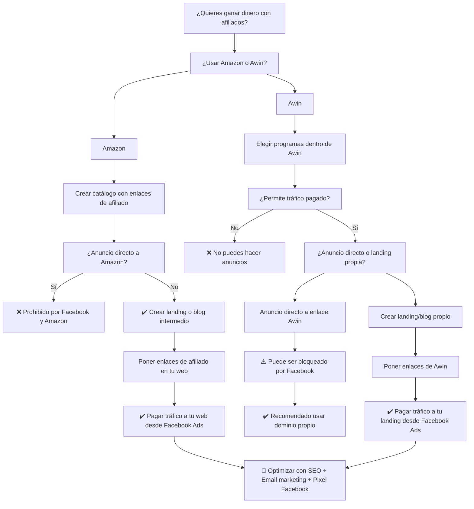
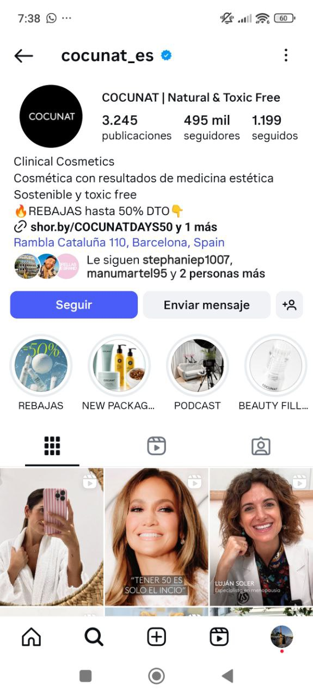
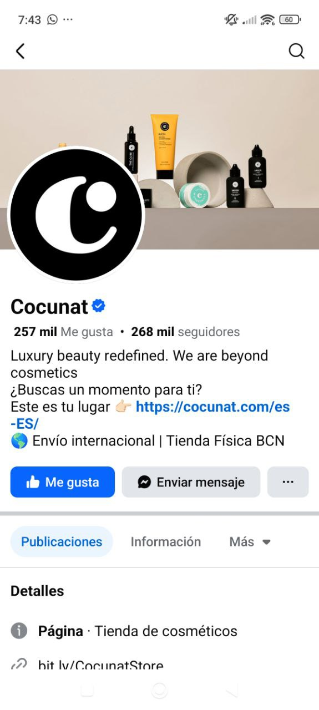
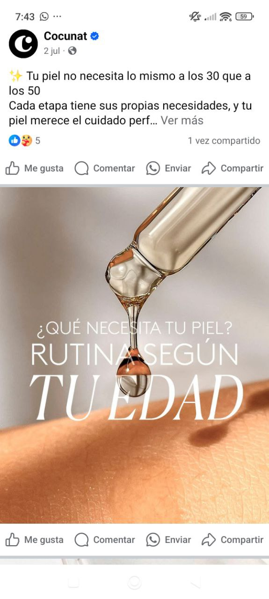
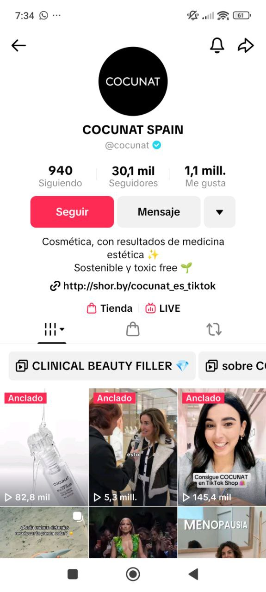
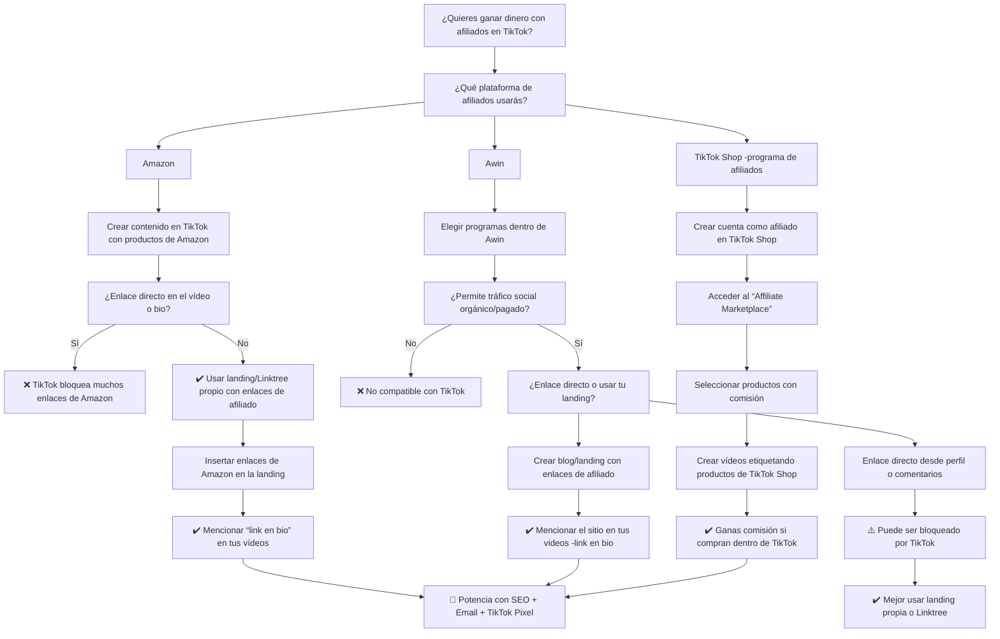

# Investigación

* De forma orgánica la tienda no se muestra(Instagram y Facebook) como EE. UU.&#x20;

Instagram:

<figure><figcaption></figcaption></figure>

Facebook:

<figure><figcaption></figcaption></figure>

<figure><figcaption></figcaption></figure>

tiktok: De forma orgánica la tienda solo se muestra en la app móvil&#x20;

<figure><figcaption></figcaption></figure>

\
.jpg>)

<figure><figcaption></figcaption></figure>

* no se puede realizar un catálogo como en Facebook o Instagram &#x20;

| Acción                                                                 | ¿Permitido?                         |
| ---------------------------------------------------------------------- | ----------------------------------- |
| Subir productos de Amazon directamente a TikTok Shop                   | ❌ No                                |
| Usar enlaces directos de Amazon en TikTok Ads                          | ⚠️ Riesgoso / No recomendado        |
| Hacer pasar productos de terceros como tuyos                           | ❌ Prohibido por políticas de TikTok |
| Usar el catálogo de TikTok para vender como afiliado sin tienda propia | ❌ No permitido                      |

