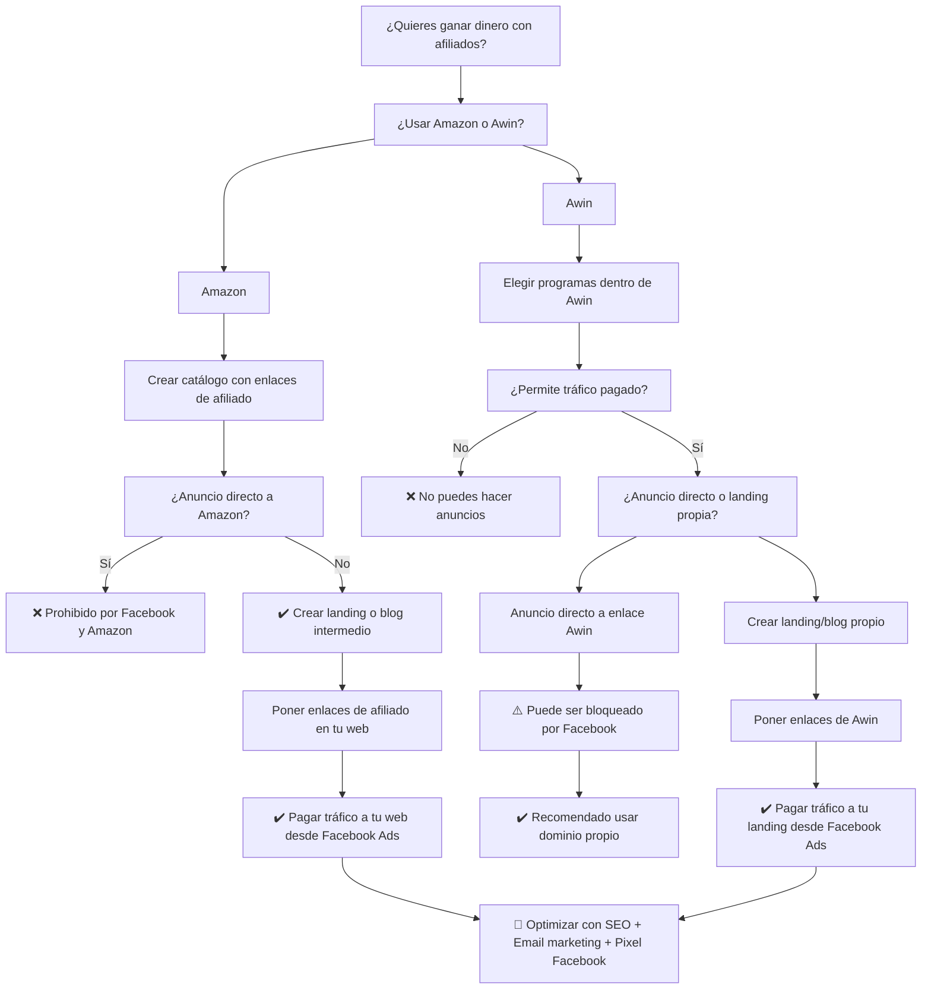
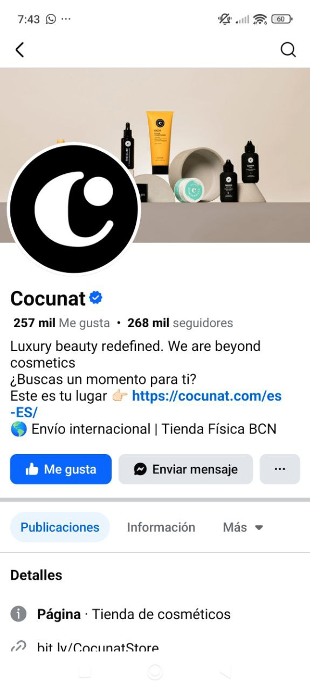
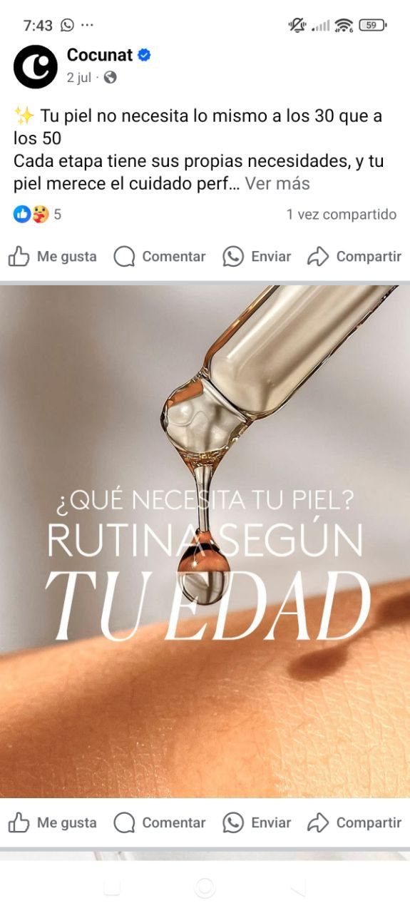
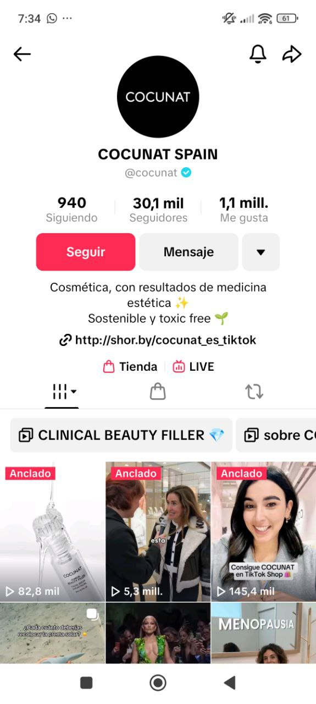
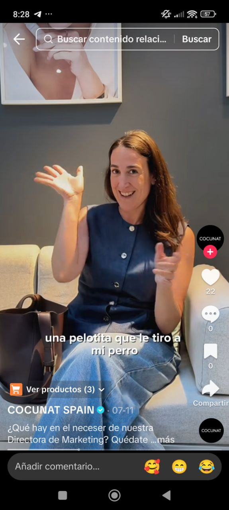
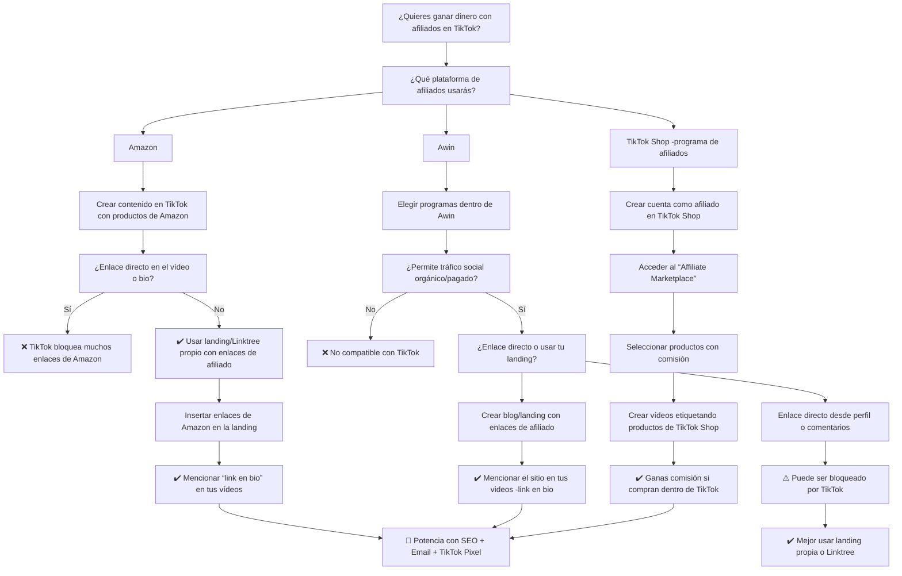

# Investigación

```mermaid
flowchart TD
    A[¿Quieres ganar dinero con afiliados?] --> B[¿Usar Amazon o Awin?]

    B --> C[Amazon]
    B --> D[Awin]

    %% AMAZON PATH
    C --> C1[Crear catálogo con enlaces de afiliado]
    C1 --> C2[¿Anuncio directo a Amazon?]
    C2 -->|Sí| C3[❌ Prohibido por Facebook y Amazon]
    C2 -->|No| C4[✔️ Crear landing o blog intermedio]
    C4 --> C5[Poner enlaces de afiliado en tu web]
    C5 --> C6[✔️ Pagar tráfico a tu web desde Facebook Ads]

    %% AWIN PATH
    D --> D1[Elegir programas dentro de Awin]
    D1 --> D2[¿Permite tráfico pagado?]
    D2 -->|No| D3[❌ No puedes hacer anuncios]
    D2 -->|Sí| D4[¿Anuncio directo o landing propia?]

    D4 --> E1[Anuncio directo a enlace Awin]
    E1 --> E2[⚠️ Puede ser bloqueado por Facebook]
    E2 --> E3[✔️ Recomendado usar dominio propio]

    D4 --> F1[Crear landing/blog propio]
    F1 --> F2[Poner enlaces de Awin]
    F2 --> F3[✔️ Pagar tráfico a tu landing desde Facebook Ads]

    %% Opcional estrategia combinada
    F3 --> G[🧠 Optimizar con SEO + Email marketing + Pixel Facebook]
    C6 --> G
```

* De forma orgánica la tienda no se muestra(Instagram y Facebook) como EE. UU.&#x20;

Instagram:

<figure><figcaption></figcaption></figure>

Facebook:

<figure><figcaption></figcaption></figure>

<figure><figcaption></figcaption></figure>

tiktok: De forma orgánica la tienda solo se muestra en la app móvil&#x20;

<figure><figcaption></figcaption></figure>

\
.jpg>)

<figure><figcaption></figcaption></figure>

<figure><figcaption></figcaption></figure>

&#x20;&#x20;

| Acción                                                                 | ¿Permitido?                         |
| ---------------------------------------------------------------------- | ----------------------------------- |
| Subir productos de Amazon directamente a TikTok Shop                   | ❌ No                                |
| Usar enlaces directos de Amazon en TikTok Ads                          | ⚠️ Riesgoso / No recomendado        |
| Hacer pasar productos de terceros como tuyos                           | ❌ Prohibido por políticas de TikTok |
| Usar el catálogo de TikTok para vender como afiliado sin tienda propia | ❌ No permitido                      |

```mermaid
flowchart TD
    A[¿Quieres ganar dinero con afiliados en TikTok?] --> B[¿Qué plataforma de afiliados usarás?]

    B --> C[Amazon]
    B --> D[Awin]
    B --> E[TikTok Shop -programa de afiliados]

    %% AMAZON PATH
    C --> C1[Crear contenido en TikTok con productos de Amazon]
    C1 --> C2[¿Enlace directo en el vídeo o bio?]
    C2 -->|Sí| C3[❌ TikTok bloquea muchos enlaces de Amazon]
    C2 -->|No| C4[✔️ Usar landing/Linktree propio con enlaces de afiliado]
    C4 --> C5[Insertar enlaces de Amazon en la landing]
    C5 --> C6[✔️ Mencionar “link en bio” en tus vídeos]

    %% AWIN PATH
    D --> D1[Elegir programas dentro de Awin]
    D1 --> D2[¿Permite tráfico social orgánico/pagado?]
    D2 -->|No| D3[❌ No compatible con TikTok]
    D2 -->|Sí| D4[¿Enlace directo o usar tu landing?]
    
    D4 --> E1[Enlace directo desde perfil o comentarios]
    E1 --> E2[⚠️ Puede ser bloqueado por TikTok]
    E2 --> E3[✔️ Mejor usar landing propia o Linktree]

    D4 --> F1[Crear blog/landing con enlaces de afiliado]
    F1 --> F2[✔️ Mencionar el sitio en tus videos -link en bio]

    %% TIKTOK SHOP PATH
    E --> TS1[Crear cuenta como afiliado en TikTok Shop]
    TS1 --> TS2[Acceder al “Affiliate Marketplace”]
    TS2 --> TS3[Seleccionar productos con comisión]
    TS3 --> TS4[Crear vídeos etiquetando productos de TikTok Shop]
    TS4 --> TS5[✔️ Ganas comisión si compran dentro de TikTok]

    %% Estrategia combinada
    C6 --> G[🧠 Potencia con SEO + Email + TikTok Pixel]
    F2 --> G
    TS5 --> G
```

* tiktok shop para creadores: necesitas 1500 seguidores en tu comunidad

### 📱 **Catálogo WhatsApp Business en España - Cómo Funciona**

#### **Lo que SÍ puedes hacer:**

✅ **Crear un catálogo visual** con hasta 500 productos\
✅ **Subir fotos** de productos\
✅ **Poner precios** y descripciones\
✅ **Organizar por categorías** (Electrónica, Hogar, etc.)\
✅ **Está disponible en España** sin restricciones

#### **Lo que NO puedes hacer:**

❌ **Links clicables** dentro del catálogo\
❌ **Botón "Comprar ahora"** directo\
❌ **Redirigir automáticamente** a Amazon o tiendas externas

***

### 🎯 **Cómo Funciona en la Práctica:**

**El catálogo es básicamente un "escaparate visual"** donde el cliente:

1. **Ve el producto** con foto bonita y precio
2. **No puede hacer clic** para comprarlo
3. **Debe escribirte** para más información
4. **Tú respondes** con el link de afiliado + info personalizada

### ✅ **Recomendación Final:**

**WhatsApp Business es EXCELENTE para afiliación** cuando:

* ✅ Tienes audiencia que confía en ti
* ✅ Vendes productos que requieren explicación/comparación
* ✅ Ofreces valor añadido (descuentos, consejos, soporte)
* ✅ Lo combinas con otros canales

**No funciona bien cuando:**

* ❌ Solo envías spam de productos sin valor
* ❌ No tienes audiencia inicial
* ❌ Vendes productos commodity sin diferenciación

#### idea&#x20;

Se pudiera crear un bot que analice las respuestas transaccionales de los usuarios y envíe automáticamente los enlaces de afiliación correspondientes.

### Telegram

Telegram Ads se presenta como mensajes patrocinados de 160 caracteres que se muestran en canales con más de 1000 suscriptores, No se pueden personalizar los anuncios, y solo se puede enlazar a un canal o bot de Telegram.

Importante es tener una comunidad y explotarla con bot como chollometro&#x20;
