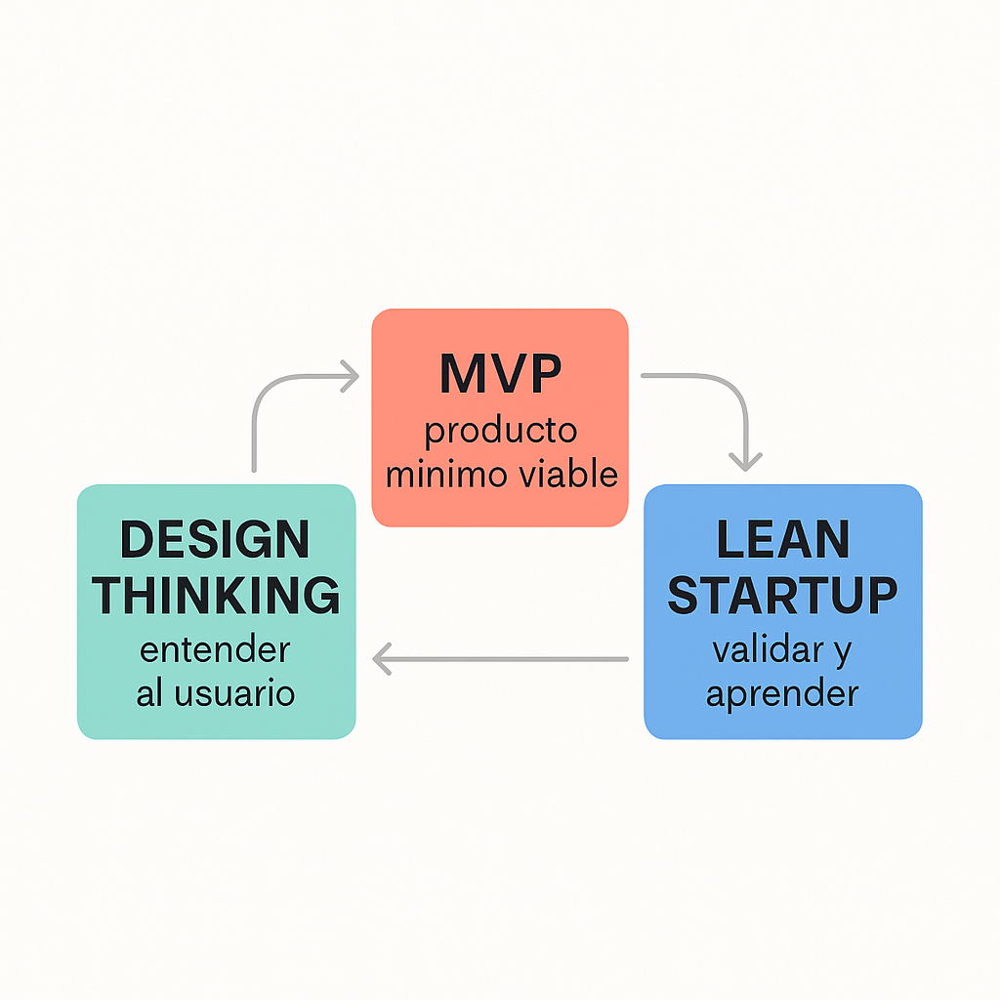

# metodología

## Qué es Design Thinking?

**Design Thinking** es una metodología para **resolver problemas y crear soluciones innovadoras** centradas en las personas. Viene del mundo del diseño, pero hoy se usa en marketing, negocios, tecnología, salud, educación… en todo.

Su objetivo es:\
👉 _Entender profundamente a las personas_\
👉 _Definir bien el problema_\
👉 _Probar muchas ideas_\
👉 _Y construir soluciones útiles, viables y deseadas_

***

### 🧭 Etapas del Design Thinking

Aquí te van las **5 fases clásicas** (según la d.school de Stanford), pero recuerda que NO son lineales: puedes ir y venir entre ellas.

| Etapa             | ¿Qué se hace?                                                                              |
| ----------------- | ------------------------------------------------------------------------------------------ |
| **1. Empatizar**  | Entender al usuario: entrevistas, observación, encuestas. Ponerse en los zapatos del otro. |
| **2. Definir**    | Reunir los insights y redactar el problema real. Ej: "Los jóvenes no leen blogs porque..." |
| **3. Idear**      | Lluvia de ideas sin juicio. Creatividad al máximo. Pensar muchas soluciones posibles.      |
| **4. Prototipar** | Crear versiones simples (maquetas, wireframes, mapas) de las ideas para testearlas rápido. |
| **5. Testear**    | Probar los prototipos con usuarios reales. Escuchar, observar, iterar.                     |
|                   |                                                                                            |

### 🔁 ¿Cómo funciona en la práctica?

1. Hablas con usuarios, detectas patrones.
2. Reformulas el problema desde su necesidad.
3. Generas muchas ideas, hasta locas.
4. Creas un prototipo (aunque sea en papel).
5. Lo pruebas, fallas rápido, mejoras rápido.

***

### 🧩 ¿Dónde se aplica?

* Marketing: entender qué necesita tu cliente _antes de venderle_.
* UX/UI: diseñar productos digitales que la gente ame usar.
* Emprendimiento: validar una idea sin gastar miles.
* Educación: crear programas útiles para el aprendizaje real.
* Y en tu caso con **social commerce**, lo puedes usar para:
  * diseñar flujos de venta desde redes sociales
  * entender cómo los usuarios interactúan con los anuncios o los comentarios
  * idear nuevas formas de automatizar sin perder la calidez humana

***

### 💡 Ejemplo mini aplicado a social commerce

1. **Empatizas**: entrevistas a usuarios de TikTok para saber cómo compran desde allí.
2. **Defines**: descubres que muchos abandonan la compra porque no entienden el precio final.
3. **Idear**: piensas en usar vídeos con precios dinámicos o stickers.
4. **Prototipas**: haces un video corto con llamadas a la acción más claras.
5. **Testeas**: lo pones en tu cuenta y ves si mejora la conversión.

## 🧪 ¿Qué es un **MVP** (Producto Mínimo Viable)?

El **MVP (Minimum Viable Product)** es la versión más simple y funcional de un producto que puedes lanzar para:

1. Ver si la gente lo usaría
2. Obtener feedback real
3. Iterar antes de gastar grande

💡 La clave es: **mínimo esfuerzo + máximo aprendizaje**

**ejemplo; MVP**:\
Creas un bot básico que responde a ciertas palabras clave en comentarios. Lo pruebas con 2 influencers.\
✔️ Si lo usan y venden más → tienes una solución viable.

## 🚀 ¿Qué es la metodología Lean Startup?

**Lean Startup** es una metodología para crear negocios o productos **rápidamente, con poca inversión, y basados en aprendizaje continuo**.

👉 Fue desarrollada por **Eric Ries** y se basa en:

* Validar hipótesis de negocio
* Aprender rápido de los errores
* Iterar sin parar hasta encontrar lo que FUNCIONA

***

***

### 🧠 Principio clave:

> ❝No construyas un producto perfecto de entrada. Lanza algo mínimo, pruébalo y mejora según lo que dice el usuario.❞

***

### 🔁 El ciclo Lean Startup

El corazón de esta metodología es el **ciclo: Construir – Medir – Aprender**.

| Fase             | ¿Qué se hace?                                                                                         |
| ---------------- | ----------------------------------------------------------------------------------------------------- |
| **1. Construir** | Crea un **MVP** (Producto Mínimo Viable): una versión simple que resuelva el problema clave.          |
| **2. Medir**     | Lanza ese MVP a un grupo reducido. Mide lo que hacen, no lo que dicen. ¿Compran? ¿Se van? ¿Preguntan? |
| **3. Aprender**  | Analiza los datos. Si funciona, sigue. Si no, **pivotas** (cambias de dirección con inteligencia).    |

### 🧠 ¿Qué significan los 3 conceptos?

| Concepto                         | ¿Qué es?                                                                                               |
| -------------------------------- | ------------------------------------------------------------------------------------------------------ |
| **Design Thinking**              | Metodología para **entender profundamente al usuario** y resolver problemas con creatividad.           |
| **Lean Startup**                 | Metodología para **validar negocios e ideas de forma ágil y económica**.                               |
| **MVP** (Producto Mínimo Viable) | Herramienta usada en Lean Startup: **versión básica de un producto** para probar rápido si sirve o no. |

### 🔗 ¿Cómo se relacionan entre sí?

#### 1. **Design Thinking** te ayuda a entender QUÉ problema resolver.

Empiezas **empatizando con el usuario**, observando su comportamiento, entendiendo sus dolores y necesidades reales.

👉 Ejemplo: descubres que los creadores se abruman al responder comentarios de ventas.

***

#### 2. **Lean Startup** te da la estructura para validar si lo que imaginaste como solución REALMENTE funciona.

Aquí defines hipótesis, lanzas un MVP, mides, y aprendes para ajustar o cambiar de dirección.

👉 Ejemplo: pruebas un bot automático que responde “Dímelo por DM” y ves si la gente lo usa.

***

#### 3. **El MVP** es la herramienta que CONECTA ambas metodologías.

Es como el **puente** entre la idea (Design Thinking) y la validación real (Lean Startup).

👉 Es la forma más rápida y barata de comprobar si tu solución vale la pena seguir desarrollándola.

***

### 🔄 Ciclo completo usando los 3

1. **Empatizas y defines el problema** → _Design Thinking_
2. **Diseñas una hipótesis y un MVP** → _Lean Startup + MVP_
3. **Lanzas, mides y aprendes** → _Lean Startup_
4. **Iteras con feedback del usuario** → _Vuelves a usar Design Thinking para mejorar_

***

### 🧩 Resumen visual (imagínatelo así)

```
🎨 Design Thinking → 👩‍💻 Identifico necesidades reales

🔬 Lean Startup → 📊 Pongo la idea a prueba con datos

🛠 MVP → 🧪 Herramienta que lanzo para validar rápido

```

<figure><figcaption></figcaption></figure>

### 🔄 **Retargeting vs Remarketing**

_Ambos buscan recuperar usuarios que ya interactuaron contigo, pero usan métodos distintos._

***

#### 🔁 **Retargeting**

➡️ Se refiere principalmente a la **publicidad pagada**, especialmente en redes sociales y Google Ads.

**📌 ¿Qué hace?**

* Muestra anuncios a personas que **visitaron tu web o interactuaron** con tu app/redes sociales, pero **no compraron**.
* Usa cookies o píxeles para rastrear.

**🧠 Ejemplo:**

Fulanita ve tu tienda de sudaderas en Etsy, pero no compra. Luego entra a Instagram y ¡pum!, le sale un anuncio tuyo con descuento.

**🔧 Herramientas:**

* Meta Ads (Facebook + Instagram)
* Google Display Network
* TikTok Ads

***

#### 🔁 **Remarketing**

➡️ Se refiere más al **seguimiento por correo electrónico o mensajes directos**.

**📌 ¿Qué hace?**

* Vuelve a contactar a usuarios que ya son **clientes o leads**, pero que están inactivos, no completaron una acción o podrían comprar otra vez.

**🧠 Ejemplo:**

Envías un email a alguien que dejó un carrito abandonado, con un mensaje tipo:\
&#xNAN;_"¿Olvidaste algo? Vuelve y termina tu compra con un 10% de descuento."_

**🔧 Herramientas:**

* Email marketing: Mailchimp, Klaviyo, ActiveCampaign
* SMS marketing
* Notificaciones push

***

### 🧩 Resumen visual:

| Concepto        | Canal principal  | Usuario objetivo                 | Ejemplo                           |
| --------------- | ---------------- | -------------------------------- | --------------------------------- |
| **Retargeting** | Anuncios pagados | Visitantes o interactuadores     | Anuncio en redes tras visitar web |
| **Remarketing** | Correos / SMS    | Leads o clientes (base de datos) | Email tras carrito abandonado     |
