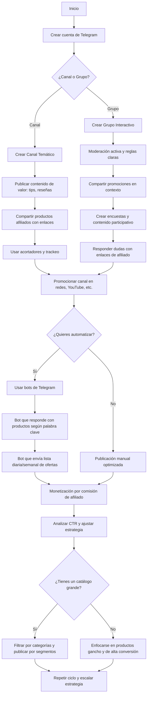

# Telegram

**Guía Completa para Usar Telegram como Canal de Ventas y Promoción de Productos de Afiliado**

***

#### ✅ 1. ¿Telegram tiene anuncios? <a href="#id-1-telegram-tiene-anuncios" id="id-1-telegram-tiene-anuncios"></a>

Sí, Telegram cuenta con una plataforma oficial de anuncios llamada **Telegram Ad Platform**, lanzada en 2021. Sin embargo, tiene varias limitaciones:

* Solo permite anuncios en **canales públicos con más de 1000 suscriptores**.
* Los anuncios son solo de **texto corto (160 caracteres)**, sin enlaces ni imágenes.
* Segmentación limitada por **idioma, tema y país**.
* El mínimo para anunciarse en la plataforma oficial es muy alto (**2 millones de euros de presupuesto**), por lo que **no está disponible para pequeños anunciantes por ahora**.

***

#### ⚖️ 2. Alternativas para promocionar productos (incluyendo afiliados) en Telegram <a href="#id-2-alternativas-para-promocionar-productos-incluyendo-afiliados-en-telegram" id="id-2-alternativas-para-promocionar-productos-incluyendo-afiliados-en-telegram"></a>

**✔ 2.1 Publicidad directa en canales**

Puedes pagar a **canales con muchos suscriptores** (10k, 50k, 100k o más) para que publiquen tu producto de afiliado:

* Contactas directamente al admin del canal.
* Negocias el precio por publicación.
* Le das un mensaje ya redactado con tu enlace de afiliado.

**Consejo:** Usa canales relacionados con el nicho de tu producto (gadgets, salud, hogar, libros, etc).

***

**✔ 2.2 Crear tu propio canal o grupo**

Puedes crear un canal para compartir contenido de valor y recomendar productos de afiliado:

* Comparte guías, consejos, comparativas.
* Publica productos con tus enlaces de afiliado (de Amazon, Aliexpress, etc.).
* Usa imágenes, descripciones atractivas y llamadas a la acción.
* Usa hashtags por categoría (#gadgets, #ofertas, etc.).

**Ejemplo de mensaje:**

```
📦 *Cámara de seguridad WiFi 1080p*
Controla tu casa desde el móvil, compatible con Alexa

📈 Valorada con 4.5/5 en Amazon
🔗 https://amzn.to/tu_enlace_de_afiliado
```

***

**✔ 2.3 Crear un bot tipo tienda o catálogo**

Puedes usar bots ya hechos como:

* [@EasyShopBot](https://t.me/EasyShopBot)
* [@StoreBot](https://t.me/StoreBot)

O crear tu propio bot con Node.js o Python. Puedes:

* Mostrar productos por categoría.
* Enviar enlaces de afiliado.
* Recibir mensajes o pedidos.

***

**✔ 2.4 Automatizaciones externas**

Con **Make (Integromat), Zapier o Pabbly**, puedes hacer que:

* Cada nuevo producto en tu web o RSS se publique en tu canal de Telegram.
* Programar publicaciones con tus enlaces.

***

#### 🚀 3. Estrategias para monetizar con afiliados en Telegram <a href="#id-3-estrategias-para-monetizar-con-afiliados-en-telegram" id="id-3-estrategias-para-monetizar-con-afiliados-en-telegram"></a>

**✅ Nichos que mejor funcionan:**

* Gadgets y tecnología
* Cocina y hogar
* Salud y cuidado personal
* Libros y formación
* Productos para mascotas
* Ofertas y cupones

**✅ Técnicas recomendadas:**

* Crear contenido valioso (guías, tips, comparativas).
* Ser constante con publicaciones (1-2 por día).
* Usar imágenes atractivas y textos breves.
* Hacer listas como "Top 5 productos para el verano".
* Usar herramientas para acortar o camuflar enlaces de afiliado.
* Incluir tus enlaces en bots, respuestas automáticas y catálogos.

***

#### 🚫 Cuidado con las normas <a href="#cuidado-con-las-normas" id="cuidado-con-las-normas"></a>

* Algunos programas de afiliados (como Amazon) **no permiten publicar enlaces directamente en Telegram**. Para evitar problemas:
  * Redirige a una página puente (como un blog o landing page).
  * Usa herramientas como Beacons, Linktree, o tu propia web.

***

#### 🌟 Conclusión <a href="#conclusion" id="conclusion"></a>

Telegram **no tiene un sistema de tienda oficial**, pero es una herramienta muy potente para vender y promocionar productos de afiliado:

* Puedes crear canales o bots como catálogo.
* Puedes pagar a canales grandes para hacer publicidad.
* Puedes usar automatizaciones para escalar.

Es especialmente útil si ya tienes una comunidad o si creas contenido de valor que genere confianza.

***


