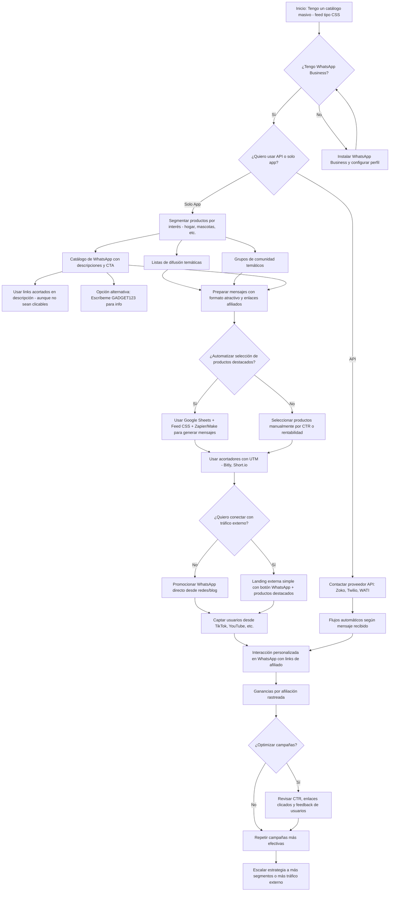

# WhatsApp

### **Guía WhatsApp para Afiliados con Catálogo Grande (Tipo CSS)** <a href="#guia-whatsapp-para-afiliados-con-catalogo-grande-tipo-css" id="guia-whatsapp-para-afiliados-con-catalogo-grande-tipo-css"></a>

***

#### 🔍 ¿Por qué WhatsApp es útil si ya tienes un catálogo completo? <a href="#por-que-whatsapp-es-util-si-ya-tienes-un-catalogo-completo" id="por-que-whatsapp-es-util-si-ya-tienes-un-catalogo-completo"></a>

Si cuentas con un **feed de miles de productos** (como ocurre al ser partner CSS de Google o usar afiliación masiva), WhatsApp puede parecer una herramienta demasiado personal. Sin embargo, combinando automatización, segmentación y creatividad, puede convertirse en un **canal potente de conversión**.

***

#### 🧠 Estrategia base: Segmentación + Mensajes personalizados + Automatización ligera <a href="#estrategia-base-segmentacion-mensajes-personalizados-automatizacion-ligera" id="estrategia-base-segmentacion-mensajes-personalizados-automatizacion-ligera"></a>

**1. Segmenta tu catálogo por intereses**

Agrupa productos en categorías útiles:

* 🐾 Mascotas
* 🏠 Hogar inteligente
* 📱 Gadgets y electrónica
* 🧴 Cuidado personal
* 👶 Bebés y familias

Usa esta segmentación para crear:

* Listas de difusión específicas (una por tema)
* Grupos temáticos activos (con normas claras)

**2. Crea mensajes preparados y automatizados**

Aunque WhatsApp no permite automatizaciones masivas sin API, puedes usar:

* Plantillas listas con emojis, negritas y enlaces acortados
* Google Sheets o Notion para organizar mensajes por segmento
* Zapier o [Make.com](http://make.com/) para generar enlaces automáticamente con UTM y acortadores

📌 _Ejemplo de mensaje:_

```
🌟 Top 3 Gadgets del Día
1️⃣ Enchufe Wifi Inteligente – Controla tus dispositivos desde el móvil 🔌  
👉 https://bit.ly/gadget1

2️⃣ Cepillo de Dientes Eléctrico con App  
👉 https://bit.ly/gadget2

3️⃣ Lámpara LED con Sensor de Movimiento  
👉 https://bit.ly/gadget3
```

**3. Crea un catálogo "mixto" en WhatsApp Business**

Aunque WhatsApp Business **no permite links clicables en productos**, puedes:

* Incluir un _dominio acortado_ en la descripción
* O bien escribir: “Escríbeme _"GADGET123"_ para más info”
* Dirigir tráfico a una **landing externa simple** con botón de WhatsApp y productos del día

***

#### 🤖 Opcional: Automatización avanzada (requiere API) <a href="#opcional-automatizacion-avanzada-requiere-api" id="opcional-automatizacion-avanzada-requiere-api"></a>

Si trabajas con proveedores como Twilio, WATI o Zoko:

* Puedes **disparar mensajes automáticos** cuando alguien escriba cierto código o se una a una lista
* Enviar recordatorios semanales con novedades
* Configurar flujos tipo chatbot que muestren productos según interés

***

#### 🧩 Integración con otras plataformas <a href="#integracion-con-otras-plataformas" id="integracion-con-otras-plataformas"></a>

* **YouTube / TikTok / Blog** → Dirige tráfico hacia tu WhatsApp
* **Google Sheets + Feed CSS** → Elige productos con mejor CTR o margen
* [**Short.io**](http://short.io/) **+ UTM** → Sigue las conversiones y optimiza por grupo o campaña

***

#### ⚠️ Recomendaciones clave para no ser bloqueado <a href="#recomendaciones-clave-para-no-ser-bloqueado" id="recomendaciones-clave-para-no-ser-bloqueado"></a>

* No hagas spam: Solo escribe a usuarios que han dado consentimiento
* No compartas enlaces sin contexto o masivamente sin valor
* Usa nombres claros, etiquetas y contenido útil en cada mensaje
* Respeta las políticas de afiliación (Amazon, Awin, etc. pueden tener restricciones en WhatsApp)

***

#### 🧠 Consejo final <a href="#consejo-final" id="consejo-final"></a>

**WhatsApp no reemplaza al email marketing o la publicidad**, pero puede ser tu mejor canal de conversión cuando:

* Alguien te escribe directamente
* Un contacto ya te conoce
* Tienes un grupo o comunidad fidelizada

Ahí es donde entra tu catálogo: **ofrecer valor diario o semanal con una selección curada** es lo que convierte este canal en dinero real.

***


